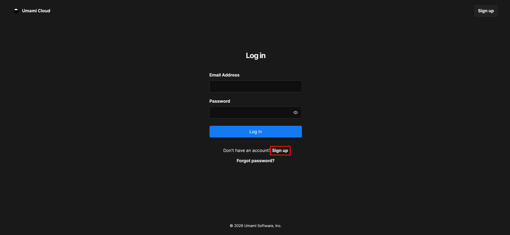
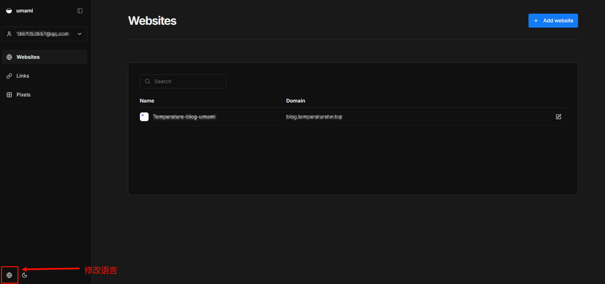
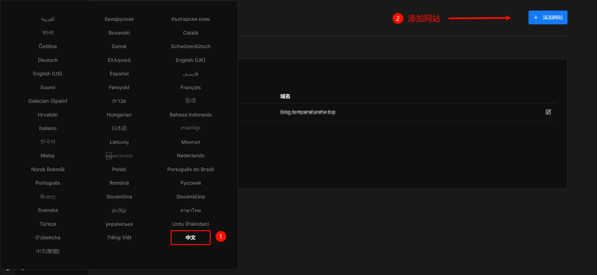
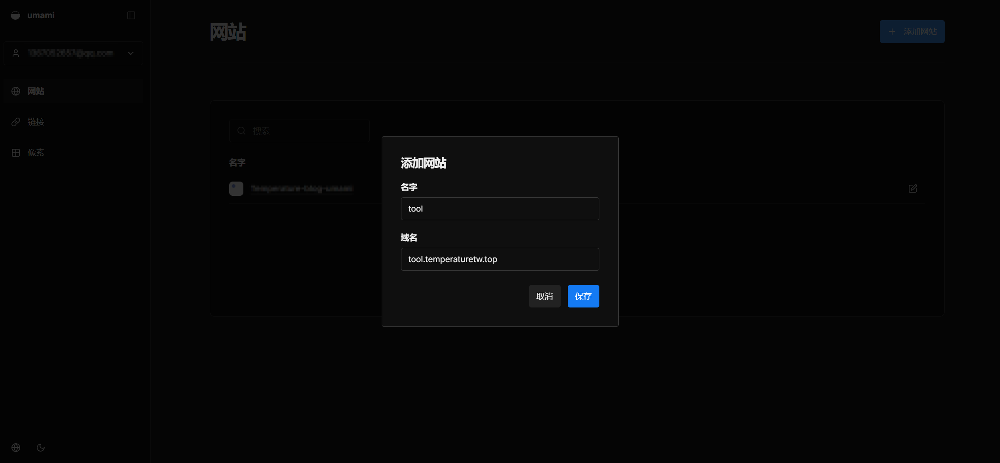
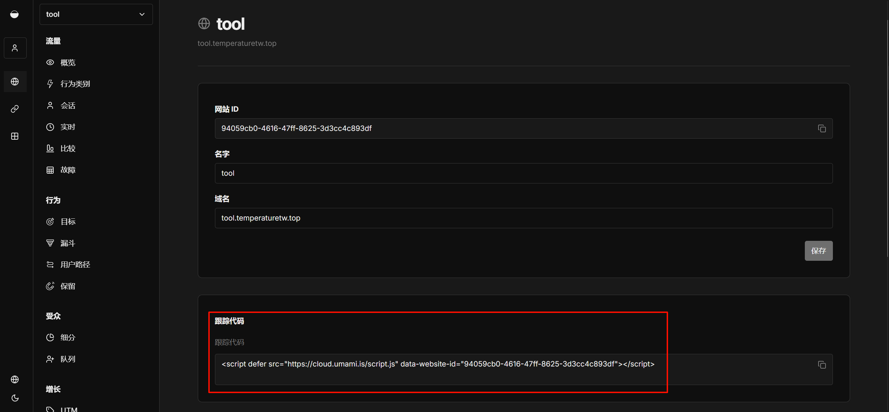
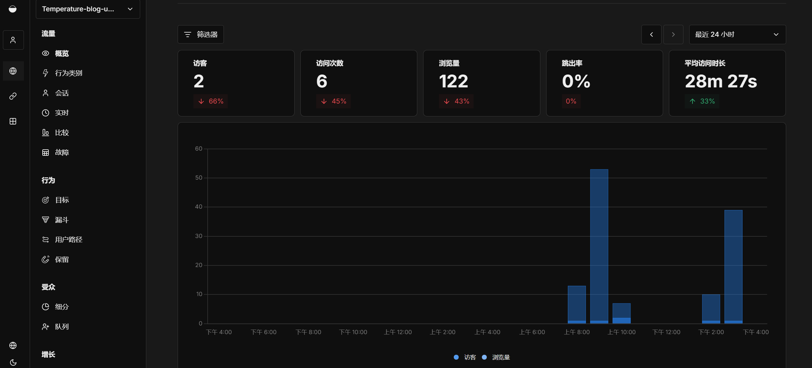
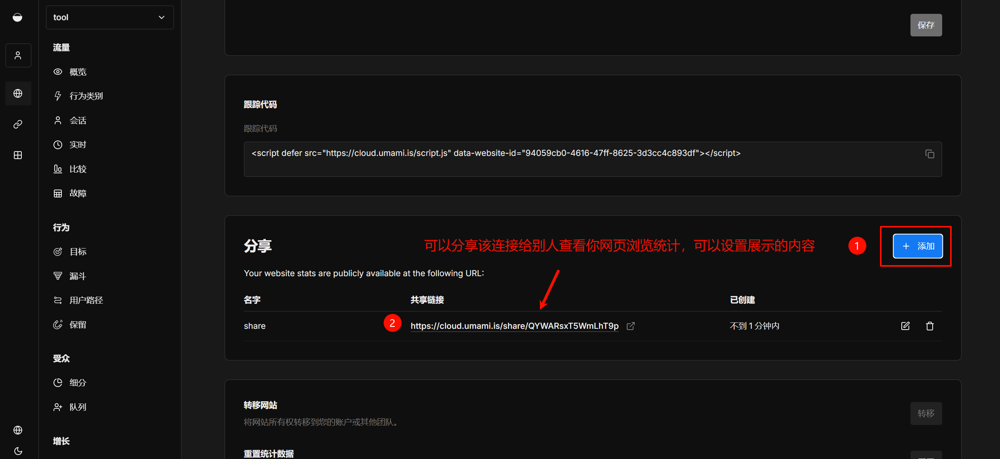

# 一、Umami介绍

Umami 是一款开源、隐私优先的网站统计分析工具，常被视为 Google Analytics 的轻量级替代品。

## 1. 核心功能

- **基础指标统计：** 实时追踪浏览量（PV）、访客数（UV）、跳出率及平均访问时长。
- **多维数据看板：** 自动分析访客的来源渠道（Referrers）、地理位置、使用的浏览器、操作系统及设备类型。
- **自定义事件：** 支持按钮点击、表单提交等交互行为的埋点追踪。
- **数据自持：** 支持自建部署（Self-hosted），所有访问数据存储在自己的数据库中。

------

## 2. 使用体验

- **轻量高效：** 追踪脚本极小（约 2KB），对网站加载速度几乎无影响。
- **界面简洁：** 单页 Dashboard 设计，数据一目了然，无学习成本。
- **多站点管理：** 一个后台可同时监控无限数量的网站。
- **共享报告：** 支持生成公开访问链接，方便向他人展示统计数据。

------

**一句话总结：** Umami 是一个**安装简单、界面漂亮且不侵犯隐私**的轻量级网站流量统计工具。


# 二、部署网页版Umami到自己的网站

[Umami网站](https://cloud.umami.is/)

## 1、简单部署

有账号登录，没账号注册











然后把跟踪代码放入到你网页代码中，一般放到`<head>` 内部

~~~html
<head>
    <title>我的网站</title>
    <script defer src="https://cloud.umami.is/script.js" data-website-id="8cb717a8-418f-4347-bea6-0eda398b8d65"></script>
</head>
~~~

这样就可以在概览中查看



### 分享统计记录



## 2、调用api查看网站浏览量

通用样例：

- **url**：`https://api.umami.is/v1/websites/{your-website-id}/stats?startAt={startAt}&endAt={endAt}`

请求头携带：

- **x-umami-api-key**: `{your-api-key}`

下列需要修改为你自己的数据

- `{your-website-id}`
- `{startAt}`：可修改数字（!!!毫秒级时间戳）
- `{endAt}`：可修改数字（!!!毫秒级时间戳）
- `{your-api-key}`

### 如何得到website-id


### 如何获取api-key


获取响应数据需要的内容（以下为样例）：

- **url**：`https://api.umami.is/v1/websites/8cb717a8-418f-4347-bea6-0eda398b8d65/stats?startAt=0&endAt=1799999999999`
- **x-umami-api-key**：`api_uXwf8Sgrpv2ZKr20Hnx6hb02Yl2e1sur`
- **website-id**：`8cb717a8-418f-4347-bea6-0eda398b8d65`


响应内容：


| Field       | Description                |
| ----------- | -------------------------- |
| `pageviews` | 页面访问量。               |
| `visitors`  | 独立访客数量。             |
| `visits`    | 独立访问次数。             |
| `bounces`   | 仅访问单个页面的访客数量。 |
| `totaltime` | 网站上的停留时间。         |

### 自己写的组件代码

``` astro title="Umami.astro" "your-website-id" "your-api-key"
---
import WidgetLayout from './WidgetLayout.astro';
import { Icon } from 'astro-icon/components';

interface Props {
	class?: string;
	style?: string;
}

const { class: className, style } = Astro.props;

const UMAMI_CONFIG = {
    baseUrl: 'https://api.umami.is/v1',
    websiteId: 'your-website-id',
    apiKey: 'your-api-key'
};

const endAt = Date.now();
const startAt = 0;

// 构造获取统计数据的 API 链接
const apiUrl = `${UMAMI_CONFIG.baseUrl}/websites/${UMAMI_CONFIG.websiteId}/stats?startAt=${startAt}&endAt=${endAt}`;
---

<WidgetLayout name="访问统计" id="umami-stats" isCollapsed={false} class={className} style={style}>
    <div class="flex flex-col gap-2 pb-2">
        <div class="flex justify-between items-center text-sm text-neutral-500 dark:text-neutral-400">
            <div class="flex items-center gap-2">
                <Icon name="material-symbols:visibility-outline-rounded" class="text-lg" />
                <span>浏览量</span>
            </div>
            <span id="umami-pageviews" class="font-bold text-neutral-700 dark:text-neutral-300">...</span>
        </div>
        <div class="flex justify-between items-center text-sm text-neutral-500 dark:text-neutral-400">
            <div class="flex items-center gap-2">
                <Icon name="material-symbols:touch-app-outline-rounded" class="text-lg" />
                <span>访问数</span>
            </div>
            <span id="umami-visits" class="font-bold text-neutral-700 dark:text-neutral-300">...</span>
        </div>
        <div class="flex justify-between items-center text-sm text-neutral-500 dark:text-neutral-400">
            <div class="flex items-center gap-2">
                <Icon name="material-symbols:person-outline-rounded" class="text-lg" />
                <span>访客数</span>
            </div>
            <span id="umami-visitors" class="font-bold text-neutral-700 dark:text-neutral-300">...</span>
        </div>
    </div>
</WidgetLayout>

<script define:vars={{ apiUrl,UMAMI_CONFIG }}>
    // 客户端获取动态 Umami 数据的脚本
    fetch(apiUrl, {
        method: 'GET',
        headers: {
            Accept: "application/json",
          	"x-umami-api-key": UMAMI_CONFIG.apiKey,
        }
    })
    .then(res => {
        if (!res.ok) {
            throw new Error('API 返回错误状态: ' + res.status);
        }
        return res.json();
    })
    .then(data => {
        if (data) {
            // 解析数据
            const pageviews = data.pageviews || 0;
            const visits = data.visits || 0;
            const visitors = data.visitors || 0;
            
            // 格式化数字
            const formatNumber = (num) => new Intl.NumberFormat('en-US').format(num);
            
            // 更新 DOM
            const elPageviews = document.getElementById('umami-pageviews');
            if (elPageviews) elPageviews.innerText = formatNumber(pageviews);

            const elVisits = document.getElementById('umami-visits');
            if (elVisits) elVisits.innerText = formatNumber(visits);
            
            const elVisitors = document.getElementById('umami-visitors');
            if (elVisitors) elVisitors.innerText = formatNumber(visitors);
        }
    })
    .catch(err => {
        console.error('获取 Umami 统计数据失败:', err);
        const elPageviews = document.getElementById('umami-pageviews');
        if (elPageviews) elPageviews.innerText = '获取失败';
        
        const elVisitors = document.getElementById('umami-visitors');
        if (elVisitors) elVisitors.innerText = '获取失败';
    });
</script>
```

### 关键代码

~~~ js "{your-website-id}" "{your-api-key}"
const startAt = 0;
const endAt = Date.now();

const apiUrl = 'https://api.umami.is/v1/websites/{your-website-id}/stats?startAt=${startAt}&endAt=${endAt}';

fetch(apiUrl, {
    method: 'GET',
    headers: {
        Accept: "application/json",
        "x-umami-api-key": {your-api-key},
    }
})
~~~

以下内容需要替换成自己的：

`{your-website-id}`

`{your-api-key}`

`{startAt}`和`{endAt}`根据自己需求修改（这个是修改获取起止时间）（!!!毫秒级时间戳）

## 3、调用api查看文章浏览量

更上述内容差不多，只用修改apiUrl ，在添加一个页面路径

### 关键代码

``` js "{your-website-id}" "{your-want-to-search-url}" "{your-api-key}"
const startAt = 0;
const endAt = Date.now();

const apiUrl = 'https://api.umami.is/v1/websites/{your-website-id}/metrics/expanded?startAt=${startAt}&endAt=${endAt}&search=${encodeURIComponent({your-want-to-search-url})}&type=path';

fetch(apiUrl, {
    method: 'GET',
    headers: {
        Accept: "application/json",
        "x-umami-api-key": {your-api-key},
    }
})
```

以下内容需要替换成自己的：

`{your-website-id}`

`{your-api-key}`

`{your-want-to-search-url}`

样例：

- **url**：`https://api.umami.is/v1/websites/94059cb0-4616-47ff-8625-3d3cc4c893df/metrics/expanded?startAt=0&endAt=1799999999999&search=&type=path`

- **x-umami-api-key**：`api_uXwf8Sgrpv2ZKr20Hnx6hb02Yl2e1sur`
- **website-id**：`8cb717a8-418f-4347-bea6-0eda398b8d65`


响应内容：


| Field       | Description                |
| ----------- | -------------------------- |
| `name`      | 唯一值，取决于指标类型。   |
| `pageviews` | 页面访问量。               |
| `visitors`  | 独立访客数量。             |
| `visits`    | 独立访问次数。             |
| `bounces`   | 仅访问单个页面的访客数量。 |
| `totaltime` | 网站上的停留时间。         |

想要调用其他接口可以查看 [官方api接口文档](https://umami.is/docs/api/website-stats) | [网站统计 - Umami 中文文档](https://umami.zhcndoc.com/docs/api/website-stats)