# 一、MinIO介绍

## 1. MinIO 是什么？有什么用？

在做网站、博客、后台管理系统，或者一些需要上传图片、文件、附件的项目时，我们经常会遇到一个问题：

**文件该怎么存，才更方便管理？**

这时候，MinIO 就是一个很实用的选择。

MinIO 本质上是一个**对象存储服务**。你可以把它理解成一个专门用来存图片、视频、附件、备份文件的“文件仓库”。它和传统把文件直接丢进服务器目录的方式不太一样，MinIO 更适合用来做独立的文件存储服务。

比如博客里的文章图片、用户上传的头像、系统中的附件、项目备份包，都可以交给 MinIO 来管理。

## 2. MinIO 有哪些功能？

MinIO 最核心的作用，就是帮你把文件统一存起来，并且通过接口或链接访问。

它常见的功能包括：

- 存储图片、视频、文档、压缩包等各种文件
- 支持通过接口上传和下载文件
- 可以给文件分目录、分桶进行管理
- 支持生成访问链接，方便前端直接使用
- 可以配合域名、HTTPS 做成正式的文件服务
- 兼容 S3 接口，很多程序都能直接接入

简单来说，**它不是普通网盘，而是更适合项目开发使用的文件存储工具**。

## 3. 为什么要用MinIO而不用市面上的OSS服务

**个人学习使用，体验自己搭建oss服务，享受免费存储访问，主要还是不用花米额外买个OSS服务，只需要付个服务器的钱(●'◡'●)**

# 二、云端部署MinIO存储

## 1. 部署方案

采用三部分：

- **Docker / Docker Compose**：统一管理服务
- **Nginx Proxy Manager（NPM）**：管理 HTTPS 证书和反向代理（简单易上手，有图形界面）
- **MinIO**：对象存储服务（S3 兼容）

## 2. 前置准备

部署前需要准备：

1. **一台 Linux 服务器**（建议 Ubuntu 22.04+）

2. **域名**，至少准备两个子域名：

   - `s3.example.com`
   - `minio.example.com`

3. **DNS A 记录** 指向这台服务器公网 IP

4. **开放端口**：

   - `80`：HTTP
   - `81`：Nginx Proxy Manager 后台（首次配置可临时开放，后续建议仅放行你自己的 IP）
   - `443`：HTTPS
   - `22`：SSH

   > 不建议直接对公网开放 MinIO 的 `9000` 和 `9001`，统一通过 NPM 反向代理。

5. 确认本机有足够磁盘空间

> 当前如果服务器总可用空间不大，建议先把 MinIO 数据量控制在 15G 左右，避免系统盘写满。

## 3. Cloudflare 域名配置

在 Cloudflare 中添加 DNS 记录（都指向 ECS 公网 IP）：

| 类型 | 名称  | 值          |
| ---- | ----- | ----------- |
| A    | minio | ECS 公网 IP |
| A    | s3    | ECS 公网 IP |

## 4. 安装 Docker 与 Docker Compose

如果是阿里云可以直接安装docker社区版

如果系统还没装 Docker，可依次执行下列指令：

```bash
sudo apt update
sudo apt install -y ca-certificates curl gnupg
sudo install -m 0755 -d /etc/apt/keyrings
curl -fsSL https://download.docker.com/linux/ubuntu/gpg | sudo gpg --dearmor -o /etc/apt/keyrings/docker.gpg
sudo chmod a+r /etc/apt/keyrings/docker.gpg

echo \
  "deb [arch=$(dpkg --print-architecture) signed-by=/etc/apt/keyrings/docker.gpg] https://download.docker.com/linux/ubuntu \
  $(. /etc/os-release && echo $VERSION_CODENAME) stable" | \
  sudo tee /etc/apt/sources.list.d/docker.list > /dev/null

sudo apt update
sudo apt install -y docker-ce docker-ce-cli containerd.io docker-buildx-plugin docker-compose-plugin
sudo systemctl enable --now docker
sudo usermod -aG docker $USER
```

> 执行完 `usermod -aG docker $USER` 后，重新登录一次 shell 再继续。

验证：

```bash
docker --version
docker compose version
```

## 5. 目录规划

目录如下：

```text
/opt/docker/
├── npm/
│   ├── data/
│   ├── letsencrypt/
│   ├── mysql/
│   ├── .env
│   └── compose.yml
└── minio/
    ├── data/
    └── compose.yml
```

创建目录：

```bash
sudo mkdir -p /opt/docker/{npm/data,npm/letsencrypt,npm/mysql,minio/data}
sudo chown -R $USER:$USER /opt/docker
cd /opt/docker
```

## 6. 编写 Docker Compose

创建 `/opt/object-storage/npm/.env`：

~~~
# Nginx Proxy Manager 数据库
MYSQL_ROOT_PASSWORD=123456
MYSQL_DATABASE=npm
MYSQL_USER=temperature
MYSQL_PASSWORD=123456
~~~

可修改为自己的内容：

- `MYSQL_ROOT_PASSWORD`
- `MYSQL_DATABASE`
- `MYSQL_USER`
- `MYSQL_PASSWORD`

创建 `/opt/docker/npm/compose.yml`：

```yaml
services:
  npm-db:
    image: mysql:8.0
    container_name: npm-db
    restart: unless-stopped
    environment:
      MYSQL_ROOT_PASSWORD: ${MYSQL_ROOT_PASSWORD}
      MYSQL_DATABASE: ${MYSQL_DATABASE}
      MYSQL_USER: ${MYSQL_USER}
      MYSQL_PASSWORD: ${MYSQL_PASSWORD}
    command:
      - --default-authentication-plugin=mysql_native_password
    volumes:
      - ./mysql/data:/var/lib/mysql
    networks:
      - proxy

  npm:
    image: jc21/nginx-proxy-manager:latest
    container_name: nginx-proxy-manager
    restart: unless-stopped
    depends_on:
      - npm-db
    ports:
      - "80:80"
      - "81:81"
      - "443:443"
    environment:
      DB_MYSQL_HOST: npm-db
      DB_MYSQL_PORT: 3306
      DB_MYSQL_USER: ${MYSQL_USER}
      DB_MYSQL_PASSWORD: ${MYSQL_PASSWORD}
      DB_MYSQL_NAME: ${MYSQL_DATABASE}
    volumes:
      - ./data:/data
      - ./letsencrypt:/etc/letsencrypt
    networks:
      - proxy

networks:
  proxy:
    name: proxy
```

说明：

- `81` 是 NPM 管理后台
- `ports`是映射到公网的
- 数据库可以根据自己需求自行替换

创建 `/opt/docker/minio/compose.yml`：

```yaml
services:
  minio:
    image: quay.io/minio/minio:RELEASE.2025-04-22T22-12-26Z
    container_name: minio
    restart: unless-stopped
    command: server /data --console-address ":9001"
    environment:
      TZ: Asia/Shanghai
      MINIO_ROOT_USER: temperature
      MINIO_ROOT_PASSWORD: 123456
      MINIO_SERVER_URL: https://s3.example.com
      MINIO_BROWSER_REDIRECT_URL: https://minio.example.com
    volumes:
      - ./data:/data
    expose:
      - "9000"
      - "9001"
    networks:
      - proxy

networks:
  proxy:
    external: true
    name: proxy
```

可修改为自己的内容：

- `MINIO_ROOT_USER`
- `MINIO_ROOT_PASSWORD`
- `MINIO_SERVER_URL`
- `MINIO_BROWSER_REDIRECT_URL`

说明：

- `9000` 是 MinIO API
- `9001` 是 MinIO Console
- `expose` 只在 Docker 内网暴露，不直接映射到公网，更安全
- `MINIO_SERVER_URL`：MinIO 服务/API 的外部访问地址
- `MINIO_BROWSER_REDIRECT_URL`：MinIO Console（网页控制台）对外访问地址

> [!WARNING]
>
> 不建议安装最新版阉割了很多功能，建议安装RELEASE.2025-04-22T22-12-26Z

## 7. 启动服务

在 `/opt/dokcer/minio`和`/opt/dokcer/npm`目录执行：

~~~bash
docker compose up -d
~~~

查看状态：

```bash
docker compose ps
```

查看日志：

```bash
docker compose logs -f npm
docker compose logs -f minio
```

## 8. 首次登录 Nginx Proxy Manager

浏览器打开：

```text
http://你的服务器IP:81
```

会显示下面的界面直接创建即可

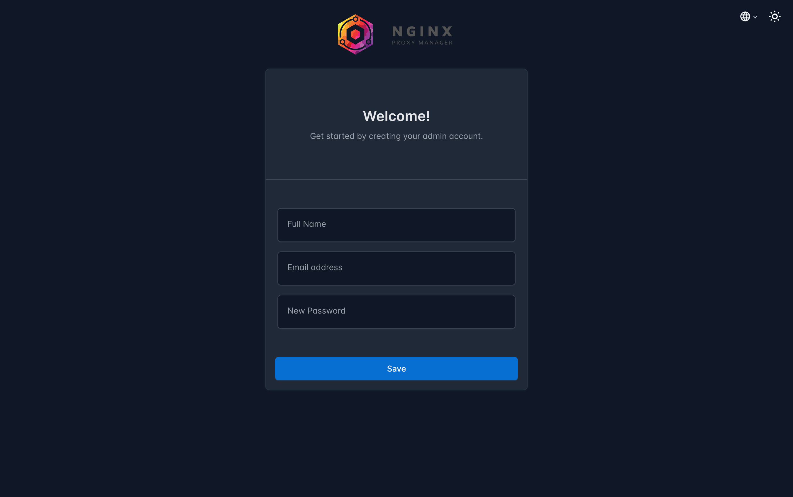

输入你创建好的账号

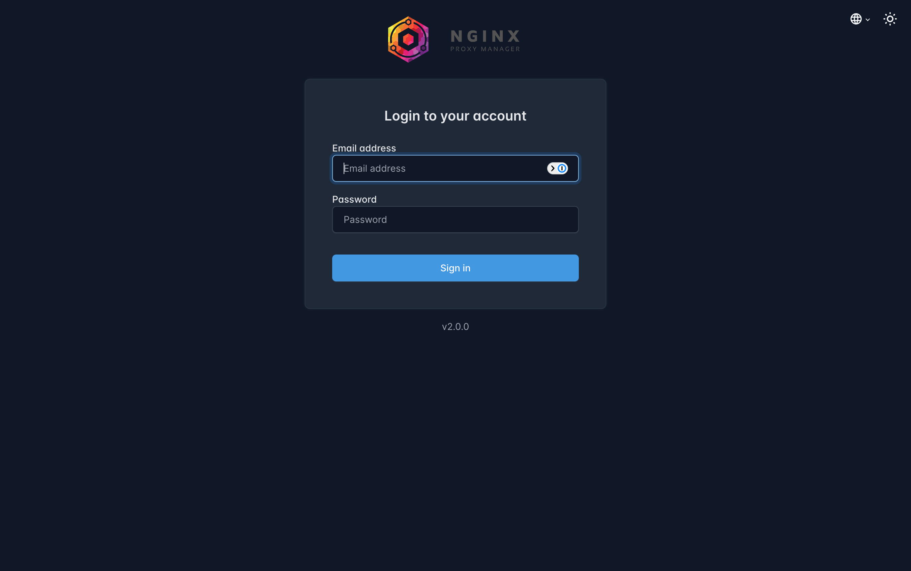

## 9. 配置 Nginx Proxy Manager 反向代理

### 9.1 为 MinIO Console 添加代理

点击Proxy Host

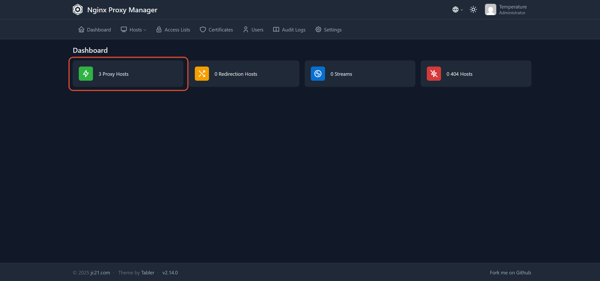

创建 Proxy Host：

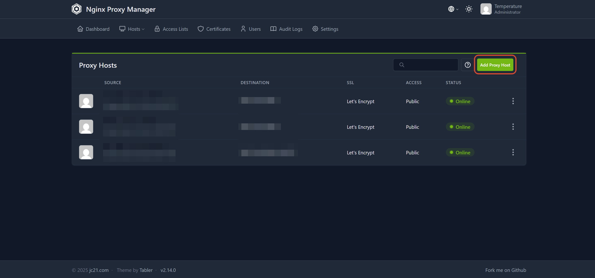

创建 Proxy Host：

- **Domain Names**: `minio.example.com`（替换成自己的域名）
- **Scheme**: `http`
- **Forward Hostname / IP**: `minio`
- **Forward Port**: `9001`
- 勾选：
  - `Block Common Exploits`
  - `Websockets Support`（建议开启）

SSL 页签：

- 申请 Let's Encrypt 证书
- 勾选 `Force SSL`
- 勾选 `HTTP/2 Support`

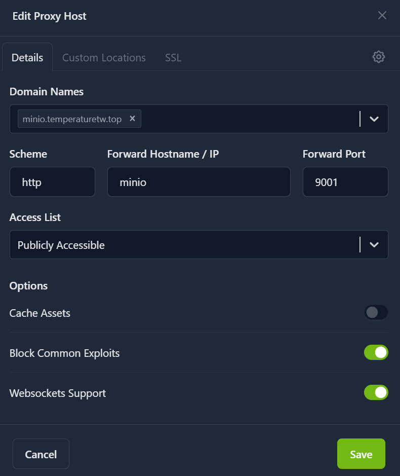

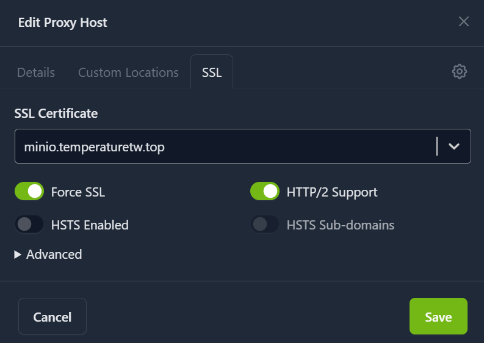

### 9.2 为 MinIO Console 添加代理

创建第二个 Proxy Host：

- **Domain Names**: `s3.example.com`（替换成自己的域名）
- **Scheme**: `http`
- **Forward Hostname / IP**: `minio`
- **Forward Port**: `9000`
- 勾选：
  - `Block Common Exploits`
  - `Websockets Support`

SSL 页签同样申请证书。

> [!WARNING]
>
> 如果服务器在国内，域名没备案，大概率会被拦截，但是有时又可以访问（QAQ），不行的话就使用服务器ip进行访问不整反代了

## 10. 登录 MinIO 并创建 Bucket

打开：

```text
https://minio.example.com
```

使用 `compose.yml` 中设置的：

- `MINIO_ROOT_USER`
- `MINIO_ROOT_PASSWORD`

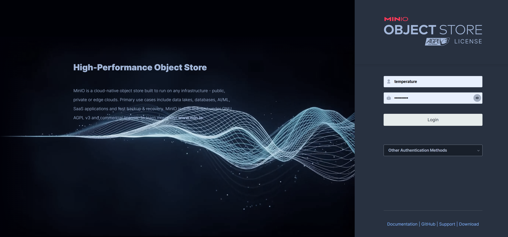

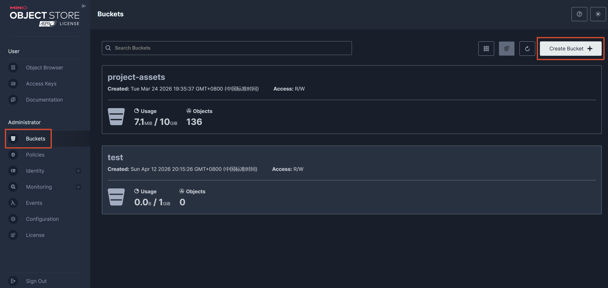

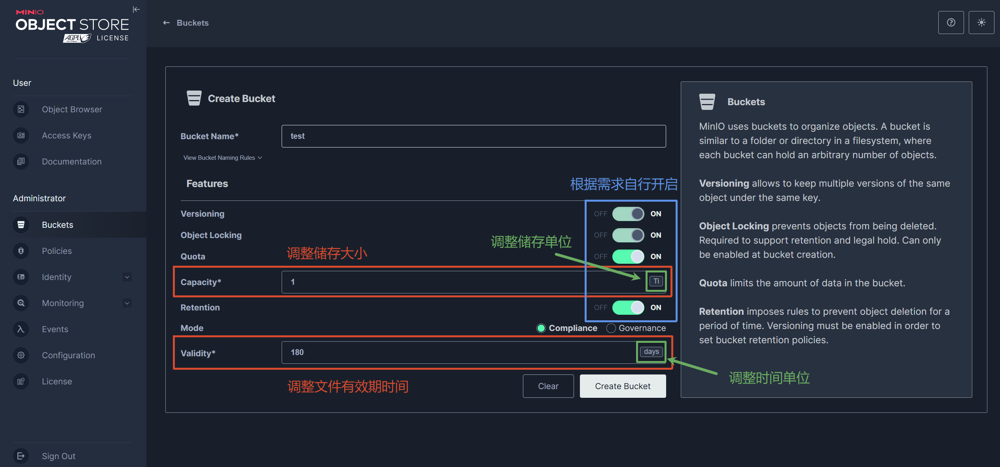

创建好桶后可以对部分功能进行编辑

> [!NOTE]
>
> **未启用的功能无法启用**

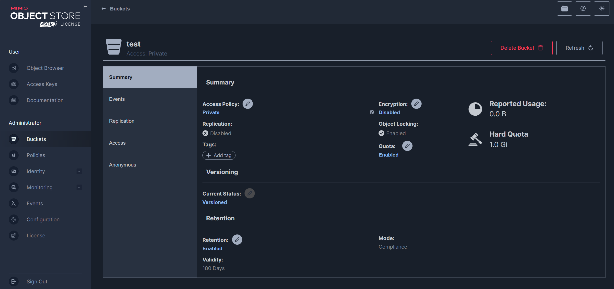

接着就可以上传你的文件了

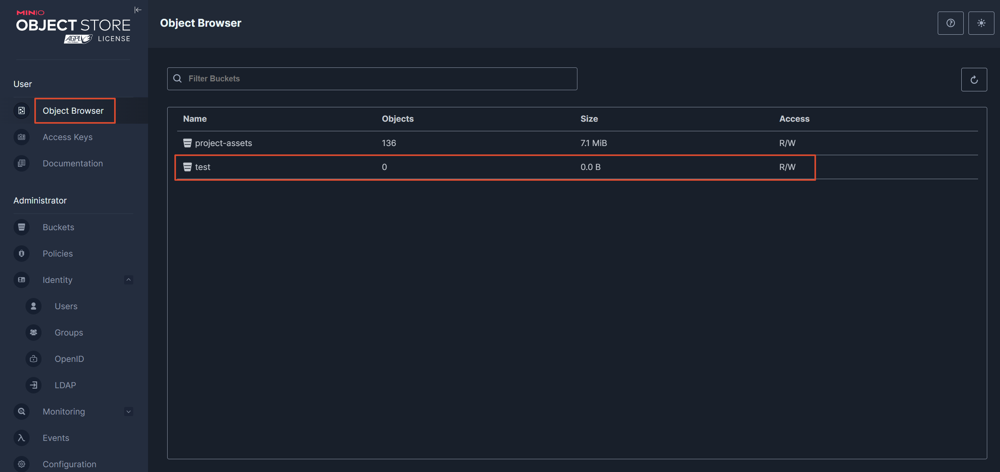

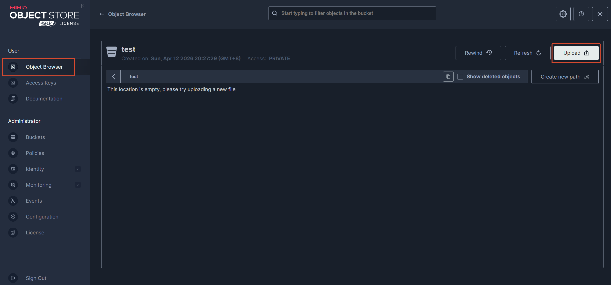

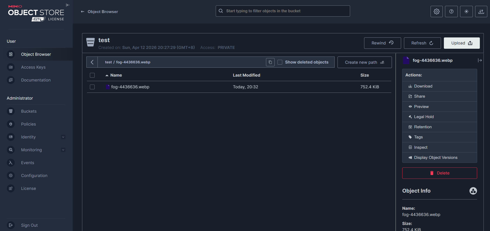

**这样就完成了云端部署MinIO存储**

下期讲后端如何实现上传和获取MinIO存储的文件，其实也可以让ai帮你接入，基本上只用提供密钥 + 用户名 + api地址
